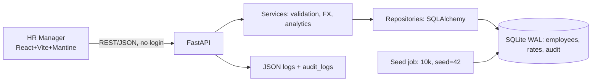

# 02 — Architecture & Design Notes

| Field    | Value                                                           |
| -------- | --------------------------------------------------------------- |
| Document | Architecture, data model, API, UI, diagrams                     |
| Version  | 1.0                                                             |
| Date     | 2026-09-21                                                      |
| Status   | Approved for build                                              |
| Stack    | FastAPI + SQLAlchemy + SQLite (WAL) · React 18 + Vite + Mantine |

## 1. Decisions (justification)

- **FastAPI over Django:** auto OpenAPI, Pydantic validation, less
  boilerplate; fastest to production-grade API for this role.
- **SQLite (WAL) over Postgres:** zero-ops single file, ample for 10k;
  repository abstraction + Alembic seam allows DSN swap later.
- **React + Vite + Mantine (locked):** Vite HMR fastest; Mantine gives
  Table/Pagination/Modal/Notifications + `useDebouncedValue` with least
  code vs MUI (heavier) / Bootstrap (dated, weak tables). Full compare in
  `local/design-notes/ui-library-full.md`.
- **Modular monolith:** one persona, 10k rows — microservices add ops cost
  assessors penalize. Stateless API still scales horizontally.
- **No auth v1:** per assessor guidance; fixed `hr_manager` actor + audit
  log; `TODO(auth)` seam for JWT/OIDC later.

## 2. Runtime view



## 3. Backend layers (`pro/app/backend/`)

`api/` (routers only) -> `services/` (rules) -> `repositories/` (queries)
-> `models/` (ORM). Plus `schemas/` (Pydantic), `core/` (config, logging,
`require_hr()` stub), `seed/`. Rule: dependencies point inward only (SOLID).

Routers: `employees.py`, `analytics.py`, `rates.py`. No `auth.py` v1.

## 4. Data model

- `employees(id UUID PK, name, email UNIQUE, department IDX, job_title,
country IDX, currency CHAR3, base_salary NUMERIC IDX, bonus NUMERIC,
joining_date, status IDX, created_at, updated_at)`
- `exchange_rates(currency_code PK, rate_to_usd NUMERIC, effective_date)`
- `audit_logs(id, actor='hr_manager', action, entity/id, old/new JSON,
reason, created_at IDX)`

Money Decimal only; soft-delete via `status`; FX normalized on read
(local + USD + `rate_date`).

## 5. API sketch

`GET /employees?search=&dept=&country=&status=&min=&max=&sort=&page=&size=`
`POST /employees` · `GET/PATCH /employees/{id}` ·
`POST /employees/{id}/increment {percent, reason}` ·
`POST /employees/{id}/deactivate` ·
`GET /analytics/summary?dept=&country=` · `GET /rates`, `POST /rates/refresh`

Envelope errors `{code,message,details,request_id}`; max page size 100.

## 6. UI structure (`pro/app/frontend/src/`)

`pages/` Dashboard, Employees, EmployeeDetail ·
`features/employees/` table + filters + edit/increment modals ·
`features/analytics/` KPI cards + charts (recharts on aggregated buckets) ·
`lib/api.ts` typed client. Dashboard answers pay questions; Employees is
daily tool. Debounced search 300ms.

## 7. Repo / Docker rule

```text
pro/                    <- GitHub root, build context
  app/                  <- ONLY this is COPY'd into images
    backend/            -> /code/backend in api image
    frontend/           -> built static / node image
  docs/                 <- review only, never shipped
  Dockerfile.backend Dockerfile.frontend docker-compose.yml
```

Seams: `TODO(history/bulk-csv/fx-live/auth)` + repository/DB seams keep
every direction extensible. Details: `03-tradeoffs-performance.md`.
